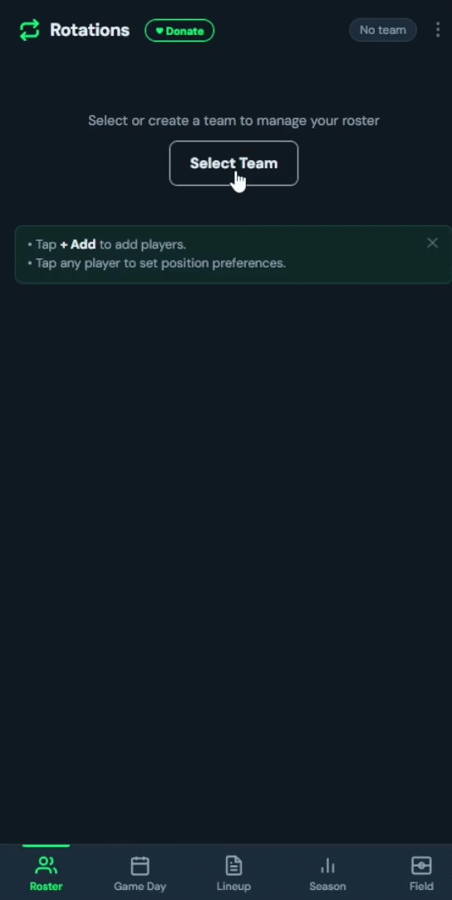
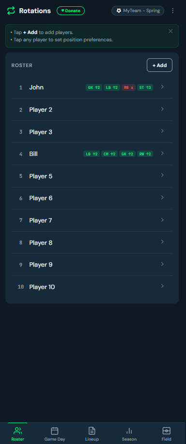
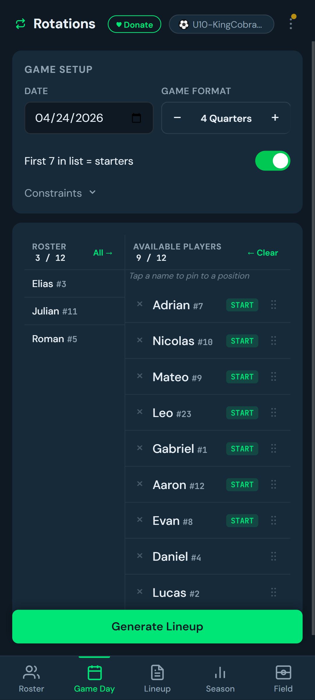
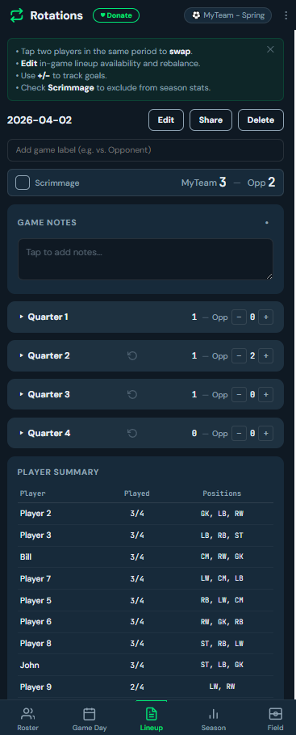
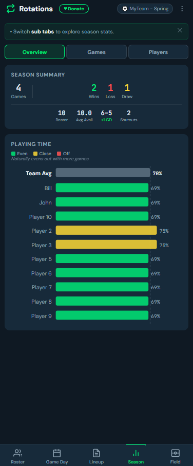
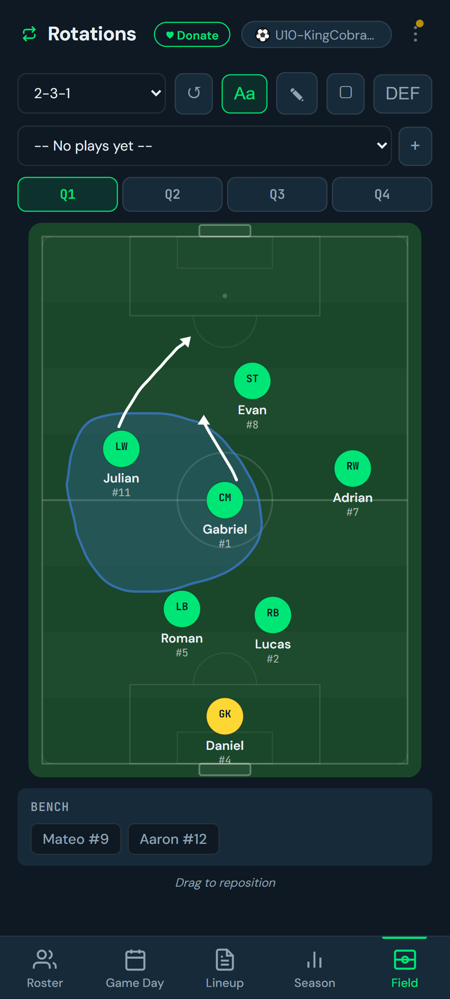
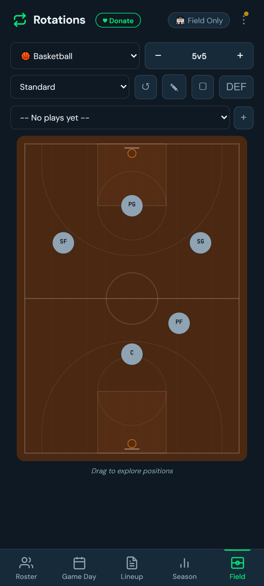

[](https://paypal.me/scottg06)
[](https://venmo.com/Scott-Greenwood-06)

# Roster Rotation Manager

Fair lineup rotations for youth sports. Generates balanced lineups that give every kid equal playing time, track goals and scores, and show season-long fairness stats. Works offline on your phone.

**Live app:** [greenwoodms06.github.io/roster-rotation](https://greenwoodms06.github.io/roster-rotation/)


<p align="center">
  
</p>
<p align="center">
  <strong>Roster rotation workflow.</strong>
</p>

<table align="center" width="100%">
  <tr>
    <td align="center" width="16.6%"><sub>Roster</sub></td>
    <td align="center" width="16.6%"><sub>Gameday</sub></td>
    <td align="center" width="16.6%"><sub>Lineup</sub></td>
  </tr>
  <tr valign="top">
    <td align="center"></td>
    <td align="center"></td>
    <td align="center"></td>
  </tr>

  <tr>
    <td align="center" width="16.6%"><sub>Stats</sub></td>
    <td align="center" width="16.6%"><sub>Field</sub></td>
    <td align="center" width="16.6%"><sub>Field Custom</sub></td>
  </tr>
  <tr valign="top">
    <td align="center"></td>
    <td align="center"></td>
    <td align="center"></td>
  </tr>
</table>

## What It Does

The rotation engine balances four things, in priority order:

1. **Equal playing time per game** — every player plays as close to the same number of periods as possible
2. **Equal playing time per season** — normalized by attendance, so missing a game doesn't penalize a player
3. **Equal position exposure** — players trend toward experiencing every position over time
4. **Position preferences** — per-player weights to prefer or avoid specific positions

Supports soccer (5v5 through 11v11), basketball, football, hockey, lacrosse, baseball, or fully custom position sets. Configurable game formats: 4 quarters, 3 periods, 2 halves, or 1 game (no divisions).

## Getting Started

1. Open the app and tap the header label to create a **team** and **season**
2. Add players on the **Roster** tab — tap any player to set position preferences
3. On **Game Day**, check who's available, set the format, then tap **Generate Lineup**
4. Use the **Lineup** tab on the sideline — tap two players in the same period to swap them
5. Track goals with the **+/−** buttons on each player row and opponent counters on period headers
6. Check **Season** for playing time charts, W-L-D record, and goal stats

## Key Features

**Lineup tab** — Collapsible period cards, tap-to-swap, goal tracking (per-player and opponent per-period), game score bar, game labels, game notes. Three sub tracking modes: Simple (instant swap), Coarse (fraction-based timing with ¼/⅓/½/⅔/¾ buttons), Fine (second-precise stepper with game clock). Position-colored timeline bars show each player's time at each position. Tap any player's bar for a full-game breakdown popup with per-period details and reset buttons. Check "Scrimmage" to exclude a game from season stats. Tap the date heading to switch between games. Edit button to add a late arrival or remove a player mid-game (injury/departure) with automatic rebalancing. Rebalance icon on period headers to re-optimize from any point forward.

**Season tab** — Three sub-tabs: Overview (games played, W-L-D record, roster size, avg availability, goals for/against with goal differential, shutouts, playing time chart), Games (availability dot chart with W/L/D letters and fairness coloring, game history with scores and fairness badges), Players (per-player stats table, position distribution, goals chart).

**Game Day constraints** — Optional controls before generating: position pins (lock a player to a position), position stickiness (reduce changes between periods), max periods per player (global cap on playing time), and per-position max (cap how many periods anyone plays a given position). Defaults configurable in Settings.

**Field tab** — SVG field diagram with draggable position dots, route drawing, zone drawing (freehand shaded areas with 4-color palette), defense overlay, and saved plays. Works standalone (no team needed) or synced with a game plan.

**Multi-team & multi-season** — Tap the context label in the header to switch teams, seasons, or use field-only mode. Each team/season has independent data. Copy a roster when creating a new season.

## Backup & Sharing

All data lives on your device. Use the **⋮** menu:

- **Back Up** — saves everything as a text file. On Android, opens the native share sheet (Drive, Messages, email, etc.). On desktop, downloads the file.
- **Restore** — pick a backup file to replace all data (a safety backup is auto-saved first)
- **Share Team** — export a single team to send to another coach
- **Import Team** — load a shared team file

## Settings

Tap **⋮ → Settings** for theme (dark/light/system), Game Structure defaults (sport, field format, game format, segment length, starter mode, position stickiness, max segments per player), Tracking & Clock defaults (sub tracking mode, clock direction), and hint management.

## Updates

The app automatically checks for updates. When a new version is available, a banner appears with a reminder to back up your data before updating. Tap **Update** to apply, or **Later** to dismiss (the banner returns on next app launch).

## Installing on Your Phone

1. Open the app URL in Chrome
2. Tap **⋮ → Add to Home Screen** (or **Install app**)
3. It runs as a standalone app with full offline support

## Donations

If you find this app useful you can consider donating in app via the **❤️ Donate** button or the PayPal or Venmo links at this top of th [README.md](./README.md). Many thanks in advance! 🙏 

## Privacy

All data lives in your device's local storage. Nothing is sent to any server. Exported files contain player names — share only with trusted people.

## Development

Pure vanilla HTML/CSS/JS. No build step, no dependencies, no npm. Files load via `<script>` tags. The service worker caches everything for offline use.

**Run tests:**

```bash
node tests/run_all.mjs
```

**Local dev server:**

```bash
python -m http.server 8000
```

Open `http://127.0.0.1:8000` (use `127.0.0.1`, not `localhost`, to avoid Chrome's HTTPS redirect).


## License

This project’s source code is available publicly for review and noncommercial use only.

Commercial use, including offering this software or a substantially similar derivative product as a paid app, subscription, service, or bundled product, is not permitted without my prior written permission.

If you want to use this project in a commercial context, please contact me first to discuss licensing.

By using, copying, modifying, or distributing this code, you agree to comply with the license terms in the repository’s `LICENSE` file.